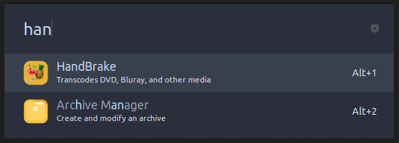

## DarkBlue Ice for ulauncher


### A Beautiful theme for ulauncher with dark blue and ice colors distributed in a harmonic way. 

---

## How to install
* Create a themes folder:
```
mkdir -p ~/.config/ulauncher/user-themes
```
* Go to:
```
cd ~/.config/ulauncher/user-themes
```
* Clone this repository
```
git clone git@github.com:Dedsd/DarkBlue-Ice-for-ulauncher.git
```
* If you don't have git download from [github releases](https://github.com/Dedsd/DarkBlue-Ice-for-ulauncher/releases)

---

Made by [André V.](https://github.com/Dedsd)
